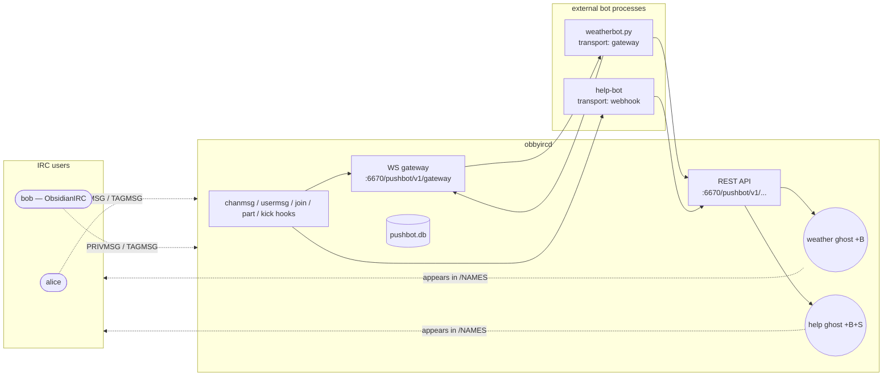
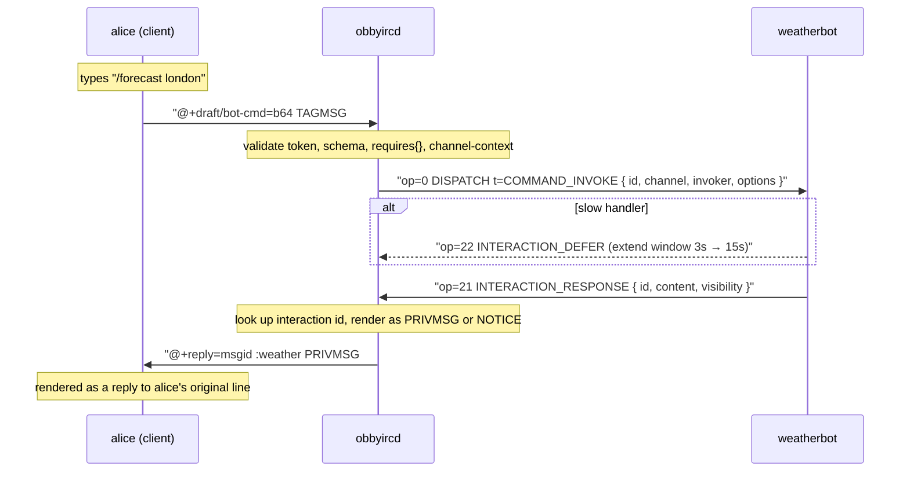
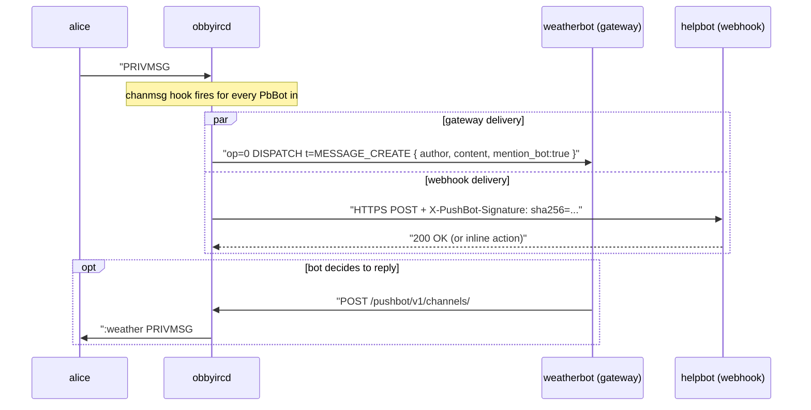
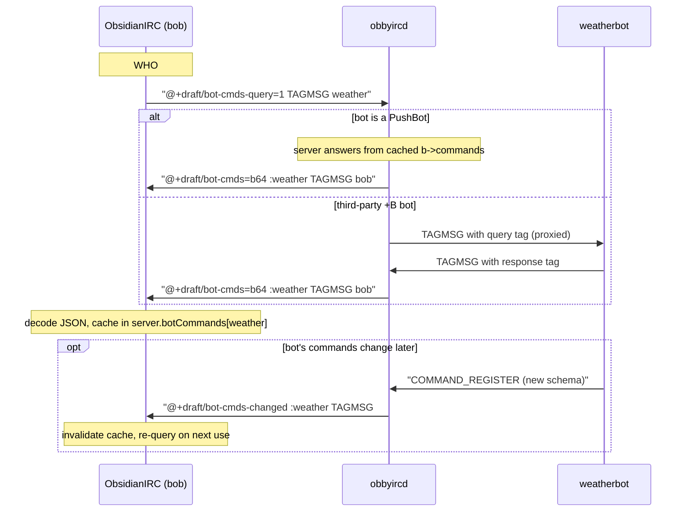
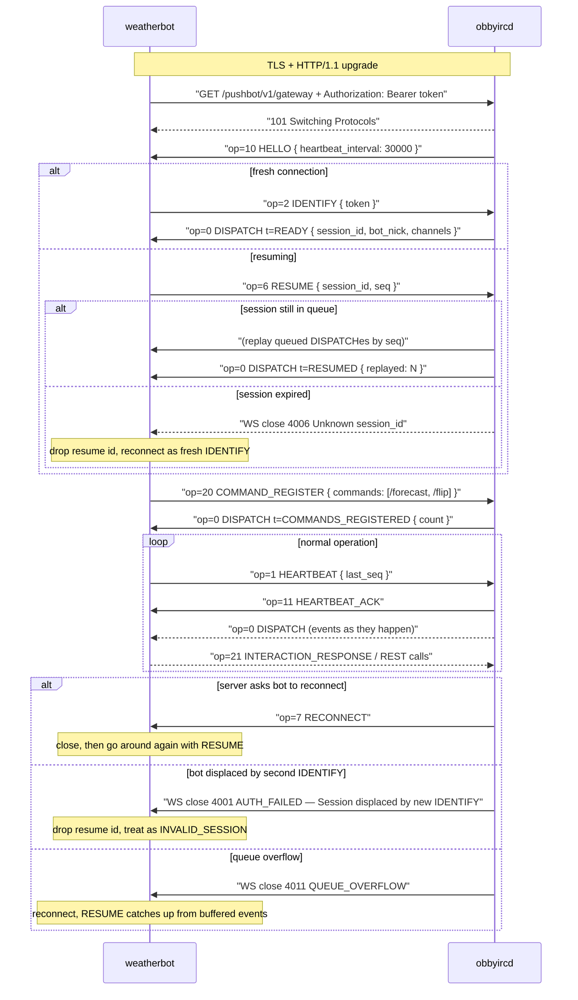

# PushBot — how users and bots interact

Visual companion to [`pushbot-spec.md`](./pushbot-spec.md).  Five Mermaid diagrams: a 30,000-ft
architecture view, then one sequence diagram per major flow.

---

## 1. System architecture

A PushBot is two things at once:

- a **real IRC user** (the ghost) — joins channels, shows up in `/NAMES`,
  receives PRIVMSGs alongside everyone else
- an **external process** somewhere on the internet that drives the ghost
  via either a long-lived WebSocket gateway or stateless HTTPS webhooks

Channel bots are scoped to specific channels (`scope=channel`, umode `+B`).
Server-wide bots like `/help` are reachable from any channel
(`scope=server`, umodes `+B+S`).  The `pushbot.db` SQLite store holds
registrations, hashed tokens, and the dead-letter queue.

---

## 2. Slash command lifecycle

User types `/forecast london` in `#weather`.  The PushBot client
serializes the invocation as a `TAGMSG` with `+draft/bot-cmd`, the IRCd
validates and routes it to the bot's gateway as `COMMAND_INVOKE`, and the
bot's reply comes back as a normal PRIVMSG tagged `+reply`.

If the bot never responds within 3 s (or 15 s after defer), the IRCd
sends `:server FAIL BOTCMD TIMEOUT weather :bot timed out` to alice.
Server-wide bots use the same flow but route on bot nick instead of
channel-membership.

---

## 3. Channel message events

Regular chatter in a channel the bot is in fires `MESSAGE_CREATE` on the
bot's gateway / webhook.  This is also how bot @mentions work — the bot
sees the message and chooses how to reply (or stays quiet).

Webhook delivery includes an HMAC-SHA256 signature so the bot can verify
the POST came from the IRCd.  Failures get retried (1s → 5s → 30s → 5m)
then dead-lettered; after a configurable failure window the bot is
auto-suspended with a server-notice to opers.

---

## 4. Command discovery

The popover in ObsidianIRC populates from `+draft/bot-cmds-query` TAGMSGs
sent to each `+B` user the client shares a channel with.  The server
either answers directly (for PushBots) or relays the query to the bot
which answers itself (for obbyscript/obbypy bots that implement the
responder).  The base64-JSON payload carries the full schema:
description, options, types, choices, requirements.

Cache is keyed by `(serverId, botNick)` with a 24 h TTL or until
explicit invalidation by `+draft/bot-cmds-changed`.

---

## 5. Bot connection lifecycle (gateway transport)

The opcode-driven state machine the gateway implements.  Identical in
shape to Discord's gateway, with one obby-specific bolt-on:
`COMMAND_REGISTER` (op=20), which is how slash command schemas get
published from the bot to the server after IDENTIFY.

Webhook bots skip everything above the `loop` block — they don't open a
gateway, the IRCd just POSTs them events directly and they reply with an
optional inline action.

---

*See [`doc/examples/weatherbot/`](../examples/weatherbot/) for a working
reference implementation of the gateway side of this protocol.*
